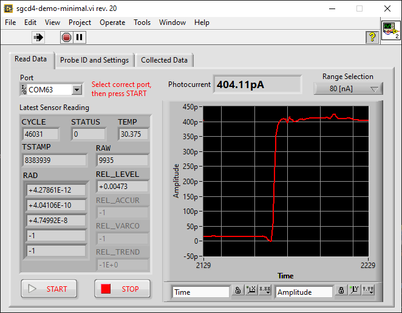
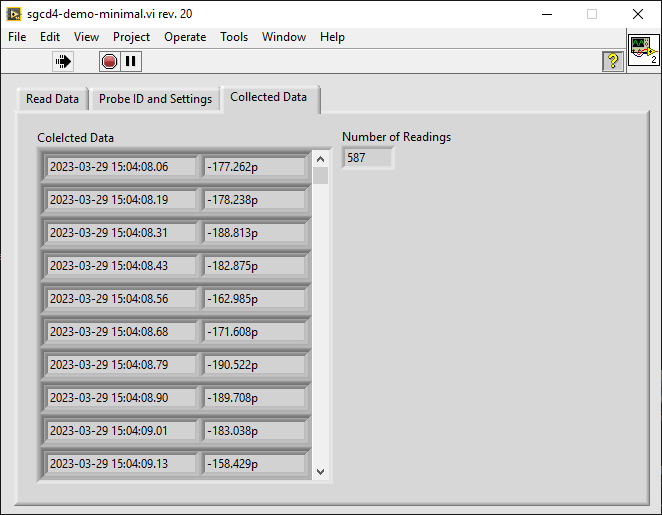

# sglux SGCD4 DAQ Example

This project demostrates as minimalistic as possible how to connect to and aquire data from a sglux [SGCD4 photocurrent aquisition system](https://sglux.de/en/produkt/sgcd4/).

## Usage
- Connect the device via USB to your computer.
- Usually a new serial device is detected and the driver installed automatically. If this is not the case, please download and install the [latest FTDI VCP driver](https://ftdichip.com/drivers/vcp-drivers/) and start over.
- Start the main VI
- Select the correct serial port (just in case open the device manager and re-plug the device to see which serial port was assigned to it)
- Click START, not the continued data aquisition runs until you press EXIT.
- Via the drop-down control the measurement range can be changed. The change takes place immediately and data aquisition continues.

## GUI Description

To keep things as simple as possible, the GUI is straightforward and not protected against wrong input. No further processing of the collected data has been implemented, nor has an auto-ranging function been included.

The main screen contains a tabbed interface showing port selection, the latest sensor data record, the actual photocurrent value both as a number and as a graph, and the START/STOP buttons on the default page.

*Besides the current value, another important piece of information is displayed here as REL_LEVEL. This number ranges from 0 to 1 and indicates how high the level is in relation to the end of the active measurement range. If this level is below 5%, you should consider switching to the next lower range. If it is close to 1 (or above 1) the next higher range shall be selected.*

On the second tab some information about the device and it's settings are displayed.

The third tab shows the list of the aquired data from hitting START to clicking STOP.

## Block diagram
The correct port parameters are 115200 Baud, 8E1, no flow control 

It is important to know the currently active measurement range, which can be read (and written to) Modbus register 137. This value is required to index the returned RAD array to get the correctly calibrated value 

Changing the range is done by writing a value between 0 (smallest) and 3 (widest range) to Modbus register 137 as an unsingned 16 bit value. After changing the range it is recommended to ignore a few readings (wait for 0.3 - 1 second) while the internal electronics settles to the new situation. 

The sensor internally has a sampling rate of 13.75 Hz, thus there is no sense in polling it mor often than ever 25...50 ms for a new reading (therefore the even case's timeout setting is 25 ms)

## Requirements
- Labview 2014 or later
- NI-Visa 2014 or later
- NI Modbus API [from NI](https://forums.ni.com/t5/Reference-Design-Content/LabVIEW-Modbus-API/ta-p/3524019) or [Github](https://github.com/NISystemsEngineering/LabVIEW-Modbus-API) preferrably installed via VIPM.
